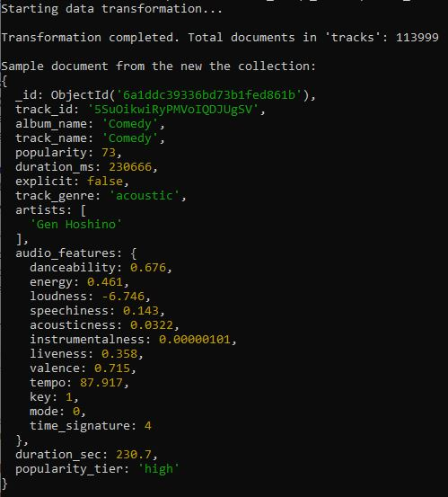
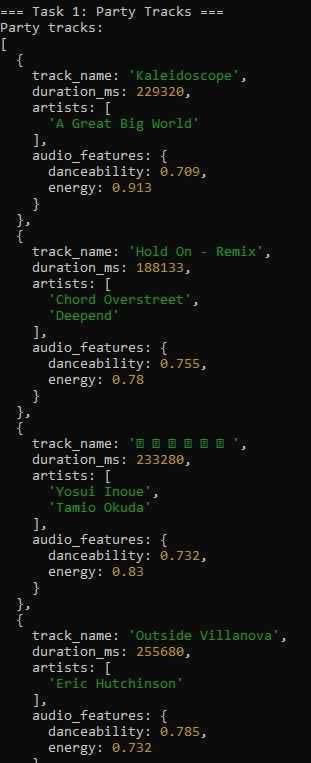
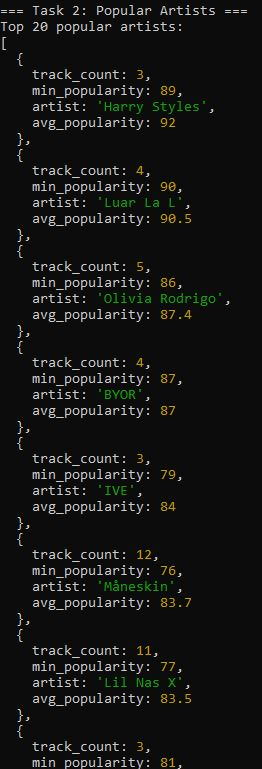
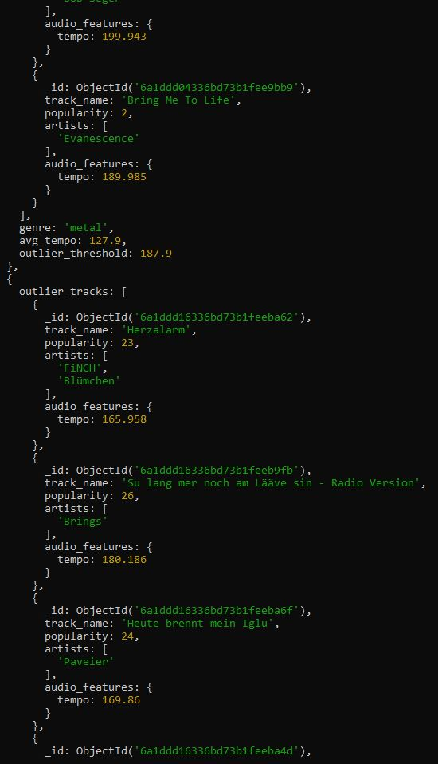
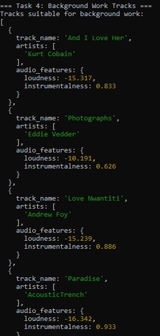
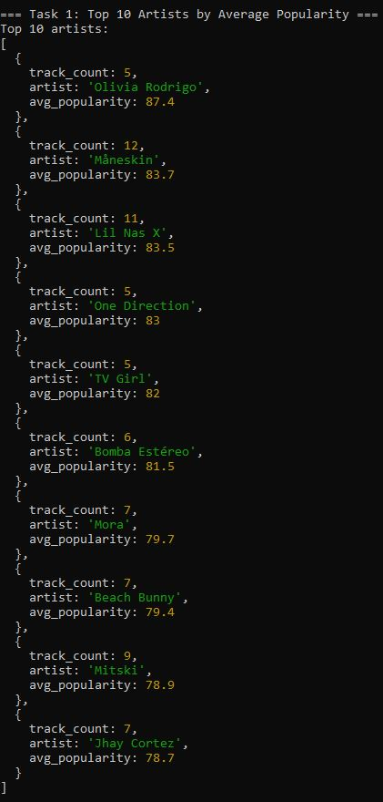
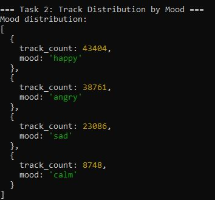
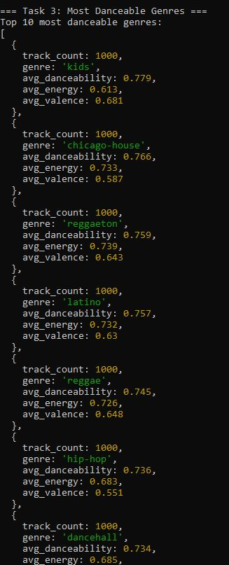
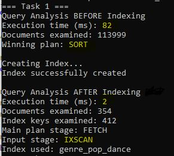
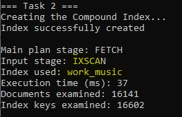

# NoSQL HW #1

## Налаштування Середовища
**1. Встановлення залежностей**
```bash
git clone <your-repository-url> && cd <repository-folder>
pip install -r requirements.txt
```

**2. Налаштування середовища**

Створіть файл `.env` у корені проєкту та додайте рядок підключення до бази:
```
MONGO_URI=mongodb+srv://<user>:<password>@<cluster-url>/
```

**3. Запуск пайплайну**

Виконайте скрипти послідовно:
```bash
python scripts/01_load_data.py
mongosh "YOUR_MONGO_URI" --file scripts/02_transform.js
mongosh "YOUR_MONGO_URI" --file queries/part2_queries.js
mongosh "YOUR_MONGO_URI" --file queries/part3_aggregations.js
mongosh "YOUR_MONGO_URI" --file queries/part4_indexes.js
```

## Частина 1

### Відповіді на питання
**1. Чому аудіо-характеристики винесені в окремий об’єкт `audio_features`, а не зберігаються плоско? Коли таке вкладення вигідне, а коли створює проблеми?**
* **Коли вигідно:** Групування пов'язаних полів створює чистішу структуру документа. Це може бути зручно для коду, коли треба передати весь об'єкт `audio_features` як єдине ціле, без необхідності вручну відфільтровувати зайві поля
* **Коли створює проблеми:** Це може трохи ускладнити запити до бази даних та індексування. Замість того, щоб писати запит `{ energy: { $gt: 0.8 } }`, доведеться використовувати `{ "audio_features.energy": { $gt: 0.8 } }`

**2. Чому виконавці зберігаються як масив, а не як рядок? Які запити стають простішими?**
* **Чому:** У одного треку може бути кілька незалежних виконавців. Зберігання їх як єдиного рядка ускладнює деякі запити до бази (необхідність парсингу)
* **Які запити стають простішими:** Пошук усіх треків конкретного виконавця. Замість того, щоб писати складні регулярні вирази, ми можемо шукати по масивах напряму

**3. Що таке `$out` і чим він відрізняється від `$merge`? Коли використовувати кожен?**
* **`$out`:** Повністю перезаписує цільову колекцію. Якщо колекція вже існує, фізично видаляє і створює наново. Підходить для початкових міграцій даних, повного перезапису бази або генерації аналітичних звітів
* **`$merge`:** Інтегрує результати пайплайну у вже існуючу колекцію. Може оновлювати старі документи, вставляти нові не видаляючи саму колекцію. Підходить для інкрементальних оновлень, де потрібно зберегти історичні записи

### Виконання завдання
**Схема даних:**
* Колекція tracks оптимізована під документо-орієнтовану структуру:
* Вкладені об'єкти: Технічні метрики (tempo, energy, danceability тощо) логічно згруповані у полі audio_features
* Масиви: Поле artists перетворено на масив рядків
* Обчислювані поля: Додано поля duration_sec та popularity_tier, розраховані під час етапу трансформації




## Частина 2

### Відповіді на питання
**1. Для чого використовується інструкція `$unwind`?**
* Агрегаційна функція `$unwind` розпаковує масив із вхідних документів та створює окремий вихідний документ для кожного елемента цього масиву. Наприклад, якщо документ одного треку має масив артистів `["Artist A", "Artist B", "Artist C"]`, `$unwind` замінить цей єдиний документ на 3 ідентичних документи. Поле `artists` у кожному з них міститиме лише одне рядок-значення. Використовується, коли потрібно групувати, фільтрувати або обчислювати статистику на основі окремих елементів усередині масиву

**2. Чим `$stdDevPop` відрізняється від `$stdDevSamp`?**
* **`$stdDevPop` (Стандартне відхилення генеральної сукупності Population):** Використовується, коли набір даних представляє *усю генеральну сукупність* (повний обсяг) даних, які нас цікавлять. Він ділить дисперсію на `N` (загальну кількість значень). У нашому завданні ми розглядаємо всі треки в певному жанрі як повну сукупність для цього жанру
* **`$stdDevSamp` (Вибіркове стандартне відхилення Sample):** Використовується, коли набір даних є лише *вибіркою* з більшої генеральної сукупності. Він застосовує поправку Бесселя, ділячи дисперсію на `N - 1`, щоб виправити математичне зміщення при оцінці дисперсії генеральної сукупності на основі невеликої вибірки

### Виконання завдання
 
 

 



## Частина 3

### Відповіді на питання
**1. У запиті 1 ми фільтруємо виконавців, у яких менше 5 треків. Як зміниться результат, якщо знизити поріг до 1? А що станеться, якщо вибирати виконавців із більш ніж 50 треками? Поясніть результат.**
* **Якщо знизити поріг:** Топ-10 буде заповнений випадковими артистами або виконавцями одного хіта. Якщо маловідомий артист випустив лише 1 трек, але він отримав популярність 98, його середня популярність становитиме 98. Результат втратить статистичну надійність через високу дисперсію
* **Якщо підвищити поріг:** Ми відфільтруємо майже всіх нових або трендових артистів які ще не встигли випустити 50 пісень. У Топ-10 залишаться виключно "старі" виконавці

**2. У запиті 3 ми фільтруємо жанри з менше ніж 100 треками. Чи зміниться результат, якщо знизити поріг до 50? Поясніть результат.**
* Зниження порогу до 50 дозволить потрапити до рейтингу більш вузьким жанрам. Оскільки в таких жанрах мало треків, середнє значення їхніх характеристик є менш стабільним і більш чутливим до викидів. Якщо до вибірки з 50 треків потрапить кілька дуже танцювальних пісень, середнє значення підвищиться, і цей нішевий жанр може витіснити з перших місць більш стабільні жанри, де багато треків усереднюють показники один одного. Фільтр у 100 треків є захистом від таких статистичних аномалій

### Виконання завдання
 
 
 


## Частина 4

### Завдання #1
**1. Що змінилося в плані виконання після додавання ESR-індексу?**
* **Зник COLLSCAN:** База перестала сканувати всю колекцію, значення `totalDocsExamined` впало
* **Зник In-memory SORT:** Оскільки індекс вже містить відсортовані дані (`popularity: -1`), важка стадія `SORT` в оперативній пам'яті пішла
* **Зросла швидкість:** Час виконання `executionTimeMillis` значно зменшився 

**2. Як зрозуміти, що індекс використовується?**
* Замість `COLLSCAN` головною стадією стає `FETCH` (завантаження документа), а вкладеною `inputStage` стає `IXSCAN`(сканування індексу)
* Наявність імені індексу у полі `inputStage.indexName`
* `totalDocsExamined` падає і наближається до кількості повернутих документів

 

### Завдання #2
На скріншоті можемо побачити, що індекс був використаний при виконанні запиту

 

### Завдання #3

**1. Чи є запит покривним (Covered Query)?**
```javascript
db.tracks.find({
  track_genre: "pop",
  popularity: { $gte: 70 }
});
```

Ні, покривний запит виконується виключно за рахунок читання індексу (`IXSCAN`), без завантаження самих документів з диска (`FETCH`). 
Хоча поля з умови пошуку `track_genre` та `popularity` присутні в індексі, у запиті відсутня проєкція. Тому базі все одно доводиться звертатися до диска, щоб дістати відсутні поля.

**2. Як зробити запит покривним?**

Потрібно додати проєкцію, явно вказавши лише ті поля, що є в індексі та приховати `_id`:

```javascript
db.tracks.find(
  { track_genre: "pop", popularity: { $gte: 70 } },
  { _id: 0, track_genre: 1, popularity: 1 } 
);
```